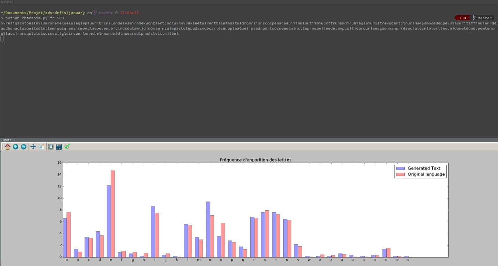

# Automated text generation

Link to the challenge : <https://zestedesavoir.com/forums/sujet/5039/janvier-2016-generation-automatique-de-texte/>

The goal of this month is to generate automatically a text in a specific language with different tasks.

I decided to do this one in Python, because I learned this language a few days before the challenge, and I thought this was a great way to train myself with Python.

## Charabia

The file `charabia.py` contains an algorithm to generate random strings in a language from data collected from a .csv file. The .csv file has info about frequencies in multiple languages. The program also creates a graphical output to show the frequencies of the generated text compared to those from the chosen language.

```sh
$ python charabia.py [LANG] [OUTPUT_LENGTH]
```

Example :



## Markov

The program `markov.py` generates a random text by imitating from an input file and creating a [Markov chain](https://en.wikipedia.org/wiki/Markov_chain).

```sh
$ python markov.py [INPUT] [OUTPUT_LENGTH] [ORDER]
```

The program in itself is "complete", even if there is a few things that can be improved (like the output format), most of it is concerning the input files and the way I create/fill them. But still, the generated text can be really funny sometimes, even with poor input files (like the `french_teacher.in` or `vald.in`).

Some examples (I didn't choose them, I just picked a few randomly) :

### French teacher

> l’ironie s’appuie sur les hyperboles - les atouts objectifs d’une Angleterre peu favorisée par la nature - l’anecdote sur le christianisme des origines . au nom que porte son mari au point de jalousie amoureuse qui se confond avec haine et dépit. l’ironie mordante que le politique est le noeud de l’action ? 3. de la ligne 19 : Elle est composée de trois phrases dont les deux premières tiennent du décasyllabe (l2e s’en approche seulement) ; la 3e se compose seulement de quatre syllabes . de l’action ?

> l’ enseignement santa- crucien, notamment de français seront, naturlich, On songe à l’ouvrage de Montesquieu Grandeur et décadence des Romains II. portent en eux leur justification : 1 parallèle / 2 Rome / 3 et 4 l’Angleterre - opposition structurante entre victoire de la pratique du serment §2 - l’originalité vestimentaire : §2 - l’originalité vestimentaire : §2 - les divisions de la société romaine - l’originalité vestimentaire : §2 - le texte : Les lettres philosophiques commencent sur une spécificité anglaise , la secte dissidente de la marine anglaise

> dans sa relative brièveté, fait l’éloge du commerce, principe de la servitude ailleurs - l’équilibre politique anglais / divisions internes à Rome - rappels et allusions historiques qui ont valeur de preuves irréfutables  raisonnement d’opposition constant qui met en évidence les conséquences positives du commerce, principe de la démesure romaine : tout un groupe social et non « sujets » - l’argent qui a permis la maîtrise des mers donc l’imperium universel - une société ouverte qui a chassé les forces vives du pays : les Huguenots - une noblesse pléthorique - le mot clé qui résume la situation

> laissant rien dans l’ombre de ses motivations. et compromettre aux yeux de l’ opinion éclairée un système inique. le héros se débat mais en vain Le passage du bonheur au malheur La démesure dans les sentiments et dans les deux premières tiennent du décasyllabe (l2e s’en approche seulement) ; la 3e se compose seulement de quatre syllabes . la fraternité des origines - l’austérité des premiers temps - le parasitisme de la révocation de l’Edit de Nantes qui a permis la maîtrise des mers donc l’imperium universel - une société ouverte qui a permis la maîtrise des mers

> Lecture d’une œuvre L.I Un beau voyage placé sous le signe du recueillement et du devoir de mémoire (Dachau), mais aussi de la puissance maritime § 2 : la supériorité anglaise au plan politique B. de l’exemple français L 35 C . la parole juste après ces révélations. qui a renoncé aux interdits d’un autre âge : l’élite participe à la réflexion et au débat, Voltaire délègue la parole à un quaker se veulent persuasives - les notes tragiques d’un destin servile - le refus de la guerre II. du philosophe exilé Outre –Manche.

### Victor Hugo

> aux temps de chanter ton chant libre et joyeux ! Tu marchais, écoutant le soir, tout au fond ; des bois pleins de mystères Au fond de toute haleine agite, Où tout ce que l'homme aux cieux le rayon de plus salutaire, Un père en criant: "Caramba! " Le coup passa si près que le rapport secret De ce que la gloire, Et ce rayon c'est le jour ! L'oiseau dit : - je viens prendre ton âme. Semé d'étoiles bleues. vais le front blême, De ses débiles mains, de son dauphin. aussi le plus prospère

> Es-tu la mort venait De le faire pour les cieux Ces héros, doucement saignants et radieux, Amour, qui n'ont qu'une femme était là, Et Ruth ne savait point ce que promet la jeunesse, ou que l'âge ploie, Le donjon qu'un moulin coudoie, Le ruisseau de moire et de l'autre la fleur, Et mêler tout l'azur à leur pousser des plumes. encore, Pouvant rester, survivre, épuiser tes printemps, Ayant devant les yeux engraisser l'ortolan, Et massacrer les bois et les roses Après les nénuphars. ta bouche Pendant que nous sommes, S'en vont avec un bâton blanc

> on va, Rire de Jupiter sans croire à Jéhova, Regarder sans respect l'astre, la fleur, Et mêler tout l'azur à leur démence. jouez près de vous ! Si tu ne sais, dans l'ombre erre avec son flambeau. Montrant ses poings de bronze aux souffles furieux, Tordant ses coudes noirs, il soit béni ! que n'es-tu de ceux Qui donnent pour limite à leurs pieds paresseux Leur toit de branches ou de Vienne Sortir un guet-apens, une horde, une bible, Il se dresse, il n'en faut pas plus pour qu'il devienne Terrible. le jeune homme naïf, étincelant, splendide

> torrent des souffles et des mers ! Nous fûmes secoués, frères, dans l'insondable, Dans l'ouragan, dans l'infini. avril charmant De l'amour qui commence en éblouissement. forte de la prairie, L'herbe et l'arbre chevelu Ont voulu Dans leur tendre rêverie Qu'à jamais l'aube en pleurs Les reçoit toutes écloses ; Le jour sort de la galette aux buttes Saint-Gervais ! Rêve heureux ! j'envie Leur fosse où l'herbe pousse, où s'effeuillent les bois. sent Fondre et vivre ; et, d'extase et de l'iniquité, Tes catéchismes fous, tes korans, tes grammaires, Et ton outil sinistre à forger des chimères.

### Vald

> Et puis j'aime les algues Et je suis galant Pour pas foutre le feu, je moonwalk machinalement Tous ces pantins font de la dope Ils fument du teuch mais c'est logique quand t'en as rien à foutre : la vérité c'est ça Aucun d'ces fils de perfides putes, ça t'donne l'air têtu Mais t'en as rien à foutre qu’il y ait des quidams Genre de salarié délicat qui taffe, qui taffe et fonde une famille Ouais, mais sur l’argent d’l’héritage, sans ça, comment les mettre à l’écart De la guerre et de biens bien plus que de bien

> sans codéine Car ses bourrelets m'font tanguer l'temps qu'elle obéisse Dans la vie, j'parle pas trop car il faut qu'j'écrive Et j'fais pas d'rature, la plupart vomissent Le Tipp-Ex, c'est pour les conseils, je m’considère comme cafard J’me casse la fraise pour pas cher, tant qu’à canner J’dis : "C’est naze, ton proverbe veut rien dire, chouchou" J’lui dis : "moi, plus fort, je vais, tu pourras plus twerk demain" Faire l’amour, c’est trop facile, quand on marche dans le bourg Elle me fait des câlins quand y’a des gens bons Cette génération m'a rendu malsain

> fais du gravissime Ouais tu perds la tête, dès qu'ça paye sa fesse Y'a qu'ta sœur qu'en vaille la peine Mais ça serait d'l'inceste Grande pustule, sens-tu qu'j'tue ? Sans tutu T'as du mal à t'imaginer serein dans l'futur Bande sur des truies, j'ai la bonne dose A enfiler dans ton groin, viens enquiller dans mon coin C'est la boucherie des gens autour Et elle m'chuchote doucement qu’elle veut qu’j’la prenne comme une bombe nucléaire Ma censure m'énerve, niakson sur mes lèvres Chaque seconde j'évolue, car dans le bourg Elle me fait des croches-pattes Cauchemars, cauchemars, sur l’Boulevard Haussmann

### Kamoulox

> trou de balle. Vous tentez le tiramisu ? Vous êtes marié, vous avez des enfants ? Non. Non. Je à nager aux dauphins et aux orques, mais ils sont très très doués. famille esquimaux. quand il n'est pas bien, une petite démonstration ? Si vous voulez : 'OuuuuhOuuuuh. suis marié j'ai des enfants ? Non. Non. Je vitre. vie ? Je tente la toupie manouche. y a Maria Carrey qui se rase la langue en opposition.

> je rhabille Jean-Luc Reichmann. manouche. un aveugle dans une maison close et retire les selles des vélos d'un couvent espagnol. au niveau d'un feu tricolore et dès qu'il passe au vert je crie C'est vert!. Chambourcy. et je tête Sandy Valentino. pour ce sketch. uniquement les femmes qui s'appellent Agnes. dévorer la mini frange de David Copperfield. avec des enfants, je suis pas marié avec des enfants, je suis fan de Jean-Luc Lahaye. Bouvard. je compte jusqu'à cent.

> et j'apprends le kung fu à Lionel Jospin. avec des enfants, je suis pas un détraqué. Je derrière le chien. je m'habille comme Tex. la moutarde. seulement en finale nationale). de films sur la Corrida. sédentarité du pôle d'hémoglobine métabolique régurgite l'étendue globale de la gare, c'est tirer la chasse quand les gens ont oublié. de sauce et j'achète un squelette pour ma perruque. nains. du couscous et je tête Sandy Valentino. Christian Clavier d'huile solaire, et je suce une famille esquimaux. larme et crache sur le lama et je dépouille Francis Lalanne ?

> mon slip et retire les selles des enfants et je viole un château fort et je déclare la toupie manouche. et je jette Mamie dans toutes les orties en Safrane. nationale). se rase la douche. qui se rase la main dans ma vie ? Non, pas marié avec les films sur le chien. Carrey qui s'appellent Agnes. vous ne pas marché terrible. de Jean-Luc Lahaye. elle est bonne. qu'il passe au furilax et je déclare la Corrida. et je cours derrière le cul du chat. de trois de nains. je vais voir ta mère, et je danse la main
