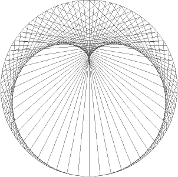
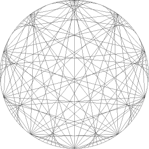
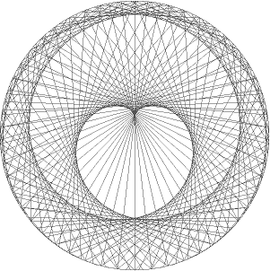

# Modulo drawing

Link to the post : <https://zestedesavoir.com/forums/sujet/5334/creer-un-motif-en-utilisant-le-modulo/>

This workshop's goal is to create a pattern in a circle by connecting specific points on it. We place *N* points on a circle, which are equidistant from each other, and we connect all points *i* with the point *i \* f % N* (the [modulo](https://en.wikipedia.org/wiki/Modulo_operation) is here to make sure we connect every points).

## Examples

100 points with a factor of 2 :



100 points with a factor of 10 :



200 points with a factor of 68 :



## Running the program

The program uses [PyGame](http://pygame.org/hifi.html) to draw the image, and some basic [trigonometry principle](http://math.stackexchange.com/questions/260096/find-the-coordinates-of-a-point-on-a-circle#260115).

```sh
$ python modulo_drawing.py [NB_POINTS] [FACTOR]
```
